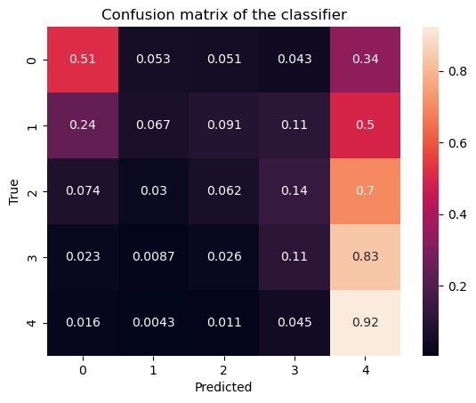
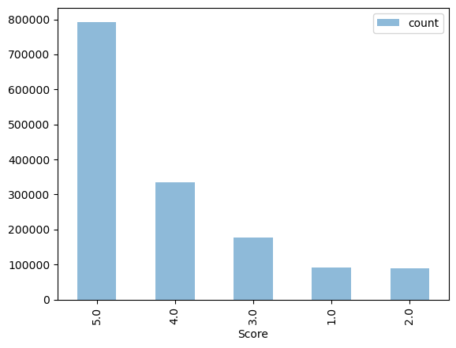

# CS506 Midterm Fall 2024: Amazon Movie Review Prediction Writeup

## Introduction
This project aimed to predict movie review scores using Amazon review data. The dataset contained user-generated review texts, metadata, and ratings between 1 and 5 stars. The primary challenge was leveraging relevant features to develop an efficient model while addressing performance constraints, given the large and potentially unbalanced dataset.

## Hypothesis/Assumptions
I hypothesize that the `text` column contains the most useful information that points towards the score given by users. Therefore, we mainly explored using `TextBlob` for sentiment and readability analysis on the `Text` field, hypothesizing that positive sentiment or high readability scores might correlate with high ratings, and vice versa. Other columns like `Time` might also provide additional information that might help improve model accuracy.

## Data Preparation and Preprocessing
1. **Loading Data and Feature Selection**:  
   The dataset included features such as `ProductId`, `UserId`, `HelpfulnessNumerator`, `HelpfulnessDenominator`, `Time`, `Summary`, `Text`, and `Score`. Given our model's scope, we focused on numerical features only, excluding using text-based features like `Summary` and `Text` directly.

2. **Feature Engineering**: 
   - **Sentiment Analysis**: I created two columns (`polarity` and `subjectivity`) using `TextBlob`'s sentiment analysis tool on the `text` column to measure the sentiment and how subjective or opinion-based the review is.
   - **Helpfulness Ratio**: I calculated the ratio of helpful votes (`HelpfulnessNumerator`) to the total votes (`HelpfulnessDenominator`) to reflect user-perceived helpfulness.
   - **Review Length**: I computed the length of each review text (word count) to represent verbosity and engagement levels indirectly.
   - **Timestamp Conversion**: Although the original `Time` column was included, its use as an actual date was not converted or expanded due to simplicity and relevance considerations.

3. **Handling Class Imbalance**:  
   The dataset was highly skewed toward 5-star ratings. To balance the training data, we used an upsampling approach on minority classes, ensuring equal representation of each class. A fixed `random_state=42` was set to make results reproducible.

4. **Train-Test Split**:  
   A 75-25 split was applied to the data to form the training and test sets. This allowed for evaluating model performance and tuning parameters without additional cross-validation, thereby saving computational resources.

## Model Selection and Tuning
After testing several models, including Support Vector Machines (SVMs) and K-Nearest Neighbors (KNNs), we selected **XGBoost (XGBClassifier)** due to its scalability and efficiency with tabular data.

## Final Model Parameters
Through preliminary experimentation (formerly using `GridSearchCV`), the following parameters were identified as optimal for the XGBoost model:
   - `learning_rate`: 0.1
   - `max_depth`: 5
   - `n_estimators`: 300
   - `subsample`: 0.8
   - `random_state`: 42 (for reproducibility)

## Packages and Libraries Used

Throughout this project, we used several Python packages and libraries that facilitated data processing, feature engineering, model building, and evaluation. Below is a breakdown of each package and its role:
### Covered in class
1. **Pandas** (`pandas`):  
   - **Purpose**: Used for data manipulation and analysis, particularly for loading, cleaning, and transforming the dataset.
   - **Usage**: Essential for reading the CSV files (`train.csv` and `test.csv`), handling missing values, calculating new features, and creating the final `submission.csv` file.

2. **Seaborn and Matplotlib** (`seaborn`, `matplotlib`):  
   - **Purpose**: Visualization libraries for plotting data distributions and evaluation metrics.
   - **Usage**: Used to plot the distribution of ratings in the dataset and to visualize the confusion matrix, providing insights into model performance across different rating classes.

3. **Scikit-learn** (`sklearn`):  
   - **Purpose**: Provides a wide range of tools for machine learning, including data splitting, resampling, and evaluation metrics.
   - **Usage**:
     - `train_test_split` for creating training and testing datasets.
     - `resample` to balance the classes by upsampling minority classes.
     - `accuracy_score` and `confusion_matrix` to evaluate model predictions.
   - **Pipeline Setup**: Initially, Scikit-learn was used to experiment with pipelines and grid search for hyperparameter tuning before we finalized the best parameters. The code for the pipeline is since then removed from the notebook.

### Not covered in class
4. **XGBoost** (`xgboost`):  
   - **Purpose**: A powerful and efficient library for gradient boosting, suitable for tabular data and widely used for classification and regression tasks.
   - **Usage**:
     - `XGBClassifier` for building and training the final classification model with specified hyperparameters.
     - Provided a balance of high accuracy and computational efficiency, making it ideal for our large dataset.

5. **TextBlob** (`textblob`):  
   - **Purpose**: A library for processing textual data, particularly for sentiment analysis and readability scoring.
   - **Usage**:
     - Initially used to generate polarity and subjectivity scores to gauge the sentiment of each review.
     - This library is called every time we generate the `X_submission` and `X-train` CSV files, which is only when we are changing the features of our dataset. Otherwise, when we are training the model, we can save computational resources by not recreating those 2 CSV files.

### Explored but not used in final submission
6. **NLTK** (`nltk` - Natural Language Toolkit):  
   - **Purpose**: A natural language processing library, primarily used here for the VADER sentiment analyzer.
   - **Usage**:
     - VADER (Valence Aware Dictionary and sEntiment Reasoner) from NLTK was tested for extracting compound, positive, neutral, and negative sentiment scores from review text.
     - Although ultimately excluded, VADER was considered for providing additional insights on sentiment polarity.

## Special Techniques and Optimization
1. **Memory Efficiency**:  
   Through various prior GridSearch, we have discovered the optimal parameters above. Therefore, when we are experimenting on our features but not the model, we omit `GridSearchCV` and set parameters directly. By doing this, we avoided the high memory overhead of tuning multiple parameter combinations, which had previously caused memory issues and computer crashes. Limiting the data to relevant numerical features (excluding text) also helped manage memory constraints effectively.
   
2. **Reproducibility**:  
   Setting `random_state=42` consistently across functions (train-test split, resampling, and model instantiation) ensured that every run produced the same results and final `submission.csv` file. This reproducibility facilitated reliable comparisons during development.

3. **Class Balancing via Upsampling**:  
   Our chosen upsampling strategy ensured that each class was equally represented during training, avoiding bias toward the dominant class (5-star ratings) and enhancing model accuracy for minority classes.

## Model Evaluation
The model was evaluated using accuracy and a confusion matrix to understand how well it differentiated between the various rating categories. The confusion matrix provided insight into misclassifications and highlighted class performance. After tuning, the final model showed robust accuracy on the test set.

## Final Thoughts and Assumptions
When thinking about Amazon reviews, one would think that the most context on what the review score might be must be in the review text itself. With not much time to complete this midterm, I set out to try my best to get this work by focusing solely on the review text column. The most obvious choice here is to use sentiment analysis on the text, and for this I tried two choices: `TextBlob` and `VADER`. `TextBlob` worked fine without any problems. I tried using only the `polarity` column, but I realized that model accuracy improved substantially after I also added the `subjectivity` column. The combination of these two features is what I used in the final submission as well. I tried getting `VADER` to run, but the memory consumption is too extreme that my computer keeps crashing. This might have been an error in my code, but it is also plausible that my computer cannot handle a workload as large as this. Since the data is skewed, I also resampled to data to remove the bias in the score. The offline evaluation for this project is through a simple train-test split, which provides a realistic view of how the model generalizes. For the models, I first tried using KNNs and SVMs which have already been covered in classes. These models were relatively quick in training, and the hyperparameter search for it was also relatively easy to set up. However, the accuracy for these models are very low (at < 0.50). I did some quick research on how to use decision trees, which is the other model already covered in class. I decided to use XGBoost in the end, which I will give more detail on in the citation section below. By doing a GridSearch, I obtained the optimal parameters, made sure the code produces a reproducable `submission.csv` in the end, and produced my final submission.

## Images
### Confusion Matrix

### Biased dataset with mostly 5.0 scores

## Citation
[XGBoost Documentation](https://xgboost.readthedocs.io/en/latest/index.html)  
[Short introduction to XGBoost](https://www.geeksforgeeks.org/ml-xgboost-extreme-gradient-boosting/)  
An excerpt from the introduction above:  
What is XGBoost (Extreme Gradient Boosting)?  

XGBoost, or Extreme Gradient Boosting, is a state-of-the-art machine learning algorithm renowned for its exceptional predictive performance. It is the gold standard in ensemble learning, especially when it comes to gradient-boosting algorithms. It develops a series of weak learners one after the other to produce a reliable and accurate predictive model.Fundamentally, XGBoost builds a strong predictive model by aggregating the predictions of several weak learners, usually decision trees. It uses a boosting technique to create an extremely accurate ensemble model by having each weak learner after it correct the mistakes of its predecessors.

[TextBlob Documentation](https://textblob.readthedocs.io/en/dev/quickstart.html)  
An excerpt from the official documentation:  
TextBlob is a Python library for processing textual data. It provides a simple API for diving into common natural language processing (NLP) tasks such as part-of-speech tagging, noun phrase extraction, sentiment analysis, classification, and more.  
[Short guide on TextBlob](https://www.analyticsvidhya.com/blog/2021/10/making-natural-language-processing-easy-with-textblob/)

## External and online resources used
I approached this midterm with a combination of using ChatGPT to generate some template code for me to fill in. When researching about possible approaches, I simple used Google to search up the best NLP tools and libraries.